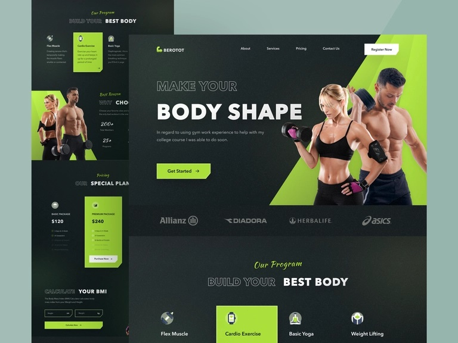

# Figma to Code - Fitness Landing Page

This is a frontend development to the [Fitness Landing Page for Callour Studio](https://dribbble.com/shots/16371194-Fitness-Landing-Page).

## Table of contents

- [Overview](#overview)
  - [Screenshot](#screenshot)
  - [Links](#links)
  - [Built with](#built-with)
## Overview

### Screenshot

### Links

- GitHub URL: [Fitness Landing Page](https://github.com/HelmiHasan)
- Live Site URL: [Netlify Live](https://enchanting-blini-531786.netlify.app/)

## My process

### Built with

- Semantic HTML5 markup
- CSS custom properties
- Flexbox
- CSS Grid
- Contains CSS animations when scrolling.
- Developed first with the Mobile First methodology, then for desktop.
- Vanila Javascript
- Includes a form to calculate body mass index.
- Includes a form to send emails.

**Note: These are just examples. Delete this note and replace the list above with your own choices**

